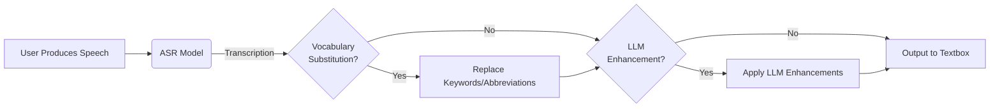

# WhisperNow

**Push-to-talk speech transcription for desktop** – fast, private, and cross-platform.

WhisperNow is a desktop application that transcribes your speech in real-time with a simple push-to-talk hotkey. It runs locally using Sherpa-ONNX ASR models, keeping your voice data private while delivering high-quality transcriptions.

---

## Features

- **Push-to-Talk Recording** – Hold a customizable hotkey to record, release to transcribe
- **High-Quality ASR** – Uses Sherpa-ONNX models including NVIDIA Parakeet and OpenAI Whisper
- **System Tray Integration** – Runs quietly in the background
- **LLM Enhancement** – Optional post-processing via OpenAI, Anthropic, Google, or local Ollama
- **Vocabulary Replacement** – Define custom word/phrase substitutions
- **Cross-Platform** – Works on Windows, macOS, and Linux
- **Auto-Typing** – Automatically types transcriptions into the active window
- **Transcription History** – Browse and copy past transcriptions

---

## Installation

### Prerequisites

- **Python 3.12+**
- **uv** package manager ([install uv](https://github.com/astral-sh/uv))

### From Source

```bash
# Clone the repository
git clone https://github.com/stephan271c/WhisperNow.git
cd WhisperNow

# Create virtual environment and install dependencies
uv sync

# Run the application
source .venv/bin/activate
whispernow
```

### Pre-built Releases

Download installers for your platform from the [Releases](https://github.com/stephan271c/WhisperNow/releases) page:

| Platform | Format |
|----------|--------|
| Windows  | `.exe` installer |
| macOS    | `.dmg` disk image |
| Linux    | `.AppImage` |

---

## How it works



---

## Quick Start

1. **Launch WhisperNow** – The app starts in the system tray
2. **Wait for model download** – First run downloads the ASR model (~100MB-1GB depending on model)
3. **Press and hold** your hotkey (default: `Ctrl+Shift`) to record
4. **Release** to transcribe – text is automatically typed into the active window

### First-Run Setup Wizard

On first launch, a setup wizard guides you through:
- Microphone permission requests
- Hotkey configuration
- Model selection

---

## Models

### ASR Models

WhisperNow uses Sherpa-ONNX for fast, efficient speech recognition. Models are automatically downloaded from GitHub on first use.

| Model | Description |
|-------|-------------|
| `Parakeet TDT v2 0.6B (FP16)` | NVIDIA Parakeet - Best accuracy, larger size |
| `Parakeet TDT v2 0.6B (Int8)` | NVIDIA Parakeet - Quantized, smaller size |
| `Whisper Distil Large v3.5` | Distilled Whisper - Good balance of speed/accuracy |
| `Whisper Small` | OpenAI Whisper Small - Moderate size |
| `Whisper Tiny` | OpenAI Whisper Tiny - Fastest, smallest |
| `Whisper Large v3` | OpenAI Whisper Large - High accuracy |

### LLM Models

WhisperNow uses litellm to interface with LLMs. You can use any LLM that litellm supports. Since the LLM is used for simple post-processing, we recommend using a small model.

| Model | Description |
|-------|-------------|
| `ollama/gemma3:1b` | Ollama Google Gemma model |
| `openai/gpt-5-nano` | OpenAI GPT-5 nano model |
| `anthropic/claude-sonnet-4-5` | Anthropic Claude model |
| `gemini/gemini-flash-latest` | Google Gemini model |

## Configuration

Access settings by clicking the tray icon → **Settings**.

### Configuration Tab
| Setting | Description |
|---------|-------------|
| Typing speed | Characters per second (0 = instant paste) |
| Start minimized | Launch to tray without showing window |
| Auto-start on login | Launch WhisperNow at system startup |
| Hotkey | Keyboard shortcut for push-to-talk |
| Sample Rate | Audio sample rate (default: 16000 Hz) |
| Input Device | Select microphone |
| ASR Model | Select from available ASR models |

### Mode Tab
Configure optional LLM post-processing:
| Provider | Description |
|----------|-------------|
| OpenAI | GPT models (requires API key) |
| Anthropic | Claude models (requires API key) |
| Google | Gemini models (requires API key) |
| Ollama | Local models (no API key needed) |

Built-in enhancements include:
- **Fix Grammar** – Correct grammar and punctuation
- **Formal Tone** – Convert to professional language
- **Casual Tone** – Make text more conversational
- **Summarize** – Condense transcription

### Vocabulary Tab
Define custom word/phrase replacements. Useful for:
- Technical jargon corrections
- Name spelling fixes
- Abbreviation expansions

---

## Project Structure

```
whispernow/
├── src/whispernow/
│   ├── app.py                # Application entry point
│   ├── bootstrap.py          # Bootstrap & entry point
│   ├── core/
│   │   ├── asr/              # Speech recognition (Sherpa-ONNX)
│   │   ├── audio/            # Audio recording & processing
│   │   ├── input/            # Hotkey handling
│   │   ├── output/           # Text output controller
│   │   ├── settings/         # Configuration management
│   │   └── transcript_processor/  # LLM & vocabulary processing
│   ├── ui/
│   │   ├── main_window.py    # Settings window
│   │   ├── tray.py           # System tray icon
│   │   ├── setup_wizard.py   # First-run wizard
│   │   ├── download_dialog.py    # Model download dialog
│   │   ├── recording_toast.py    # Recording indicator
│   │   └── tabs/             # Settings tabs
│   └── utils/
│       ├── logger.py         # Logging configuration
│       └── platform.py       # Platform-specific utilities
├── tests/                    # Test suite
├── scripts/
│   └── build.py              # Briefcase build script
├── pyproject.toml            # Project metadata & dependencies
└── installer.iss             # Windows Inno Setup script
```

---

## Development

### Running Tests

```bash
# Activate virtual environment
source .venv/bin/activate

# Run all tests
uv run pytest

# Run tests excluding slow integration tests
uv run pytest -m "not slow"

# Run with coverage
uv run pytest --cov=src/whispernow
```

### Building Distributables

```bash
# Build with Briefcase
uv run python scripts/build.py
```

**Output locations:**
- Windows: `build/whispernow/windows/app/` + `installer-output/*.exe`
- macOS: `build/whispernow/macos/app/WhisperNow.app` + `*.dmg`
- Linux: `build/whispernow/linux/appimage/*.AppImage`

### CI/CD

The project uses GitHub Actions for automated builds:

```bash
# Trigger on:
# - Push to main branch
# - Version tags (v*)
# - Pull requests to main
```

Tagged releases (`v*`) automatically create draft GitHub releases with all platform installers.

---

## Dependencies

### Core
| Package | Purpose |
|---------|---------|
| PySide6-Essentials | Qt-based GUI framework |
| pynput | Global hotkey capture |
| sounddevice | Audio recording |
| sherpa-onnx | ASR inference engine |
| litellm | Unified LLM API client |
| pydantic | Settings validation |
| platformdirs | Cross-platform paths |
| numpy | Numerical operations |

### Development
| Package | Purpose |
|---------|---------|
| pytest + pytest-qt | Testing framework |
| briefcase | Application bundling |
| black + isort | Code formatting |

---

## Platform Notes

### Linux
- Requires `xclip` for clipboard operations
- Hotkey capture may need X11 or elevated permissions

### macOS
- Requires Accessibility permissions for global hotkeys
- Microphone permission required on first use

### Windows
- No special requirements
- Installer registers start menu entry

---

## Contributing

1. Fork the repository
2. Create a feature branch (`git checkout -b feature/amazing-feature`)
3. Make your changes
4. Run tests (`uv run pytest`)
5. Commit (`git commit -m 'Add amazing feature'`)
6. Push (`git push origin feature/amazing-feature`)
7. Open a Pull Request

---

## License

This project is licensed under the MIT License
